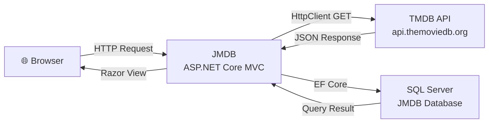
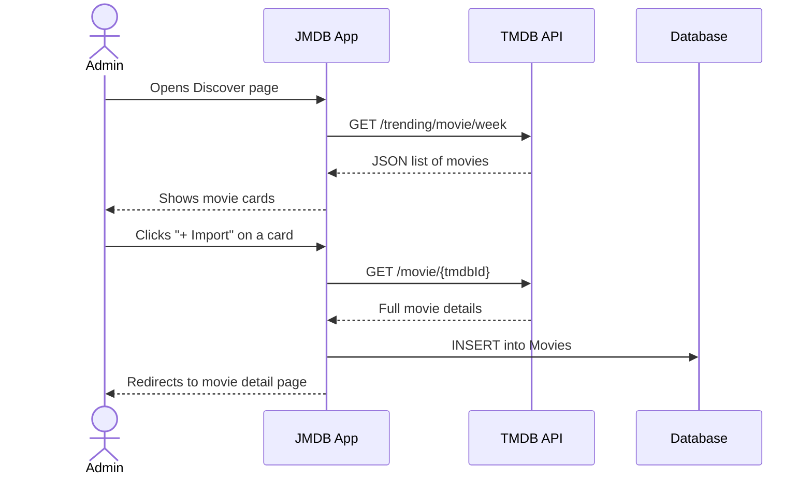

# API Architecture – JMDB

## Overview

JMDB integrates with the [TMDB API](https://developer.themoviedb.org/) (The Movie Database) to fetch movie data, posters and trending information.

## TMDB Endpoints Used

| Endpoint | Description |
|---|---|
| `GET /trending/movie/week` | Fetches trending movies for the Discover page |
| `GET /search/movie?query=...` | Searches TMDB by movie title |
| `GET /movie/{id}` | Fetches full movie details for import (includes runtime and genres) |

**Base URL:** `https://api.themoviedb.org/3/`  
**Poster images:** `https://image.tmdb.org/t/p/w500/{poster_path}`

## Import Flow

## Security

- The TMDB API key is stored using **.NET User Secrets** in development and must be set via environment variables in production
- The key is never committed to source control
- Import is restricted to **Admin** role only
