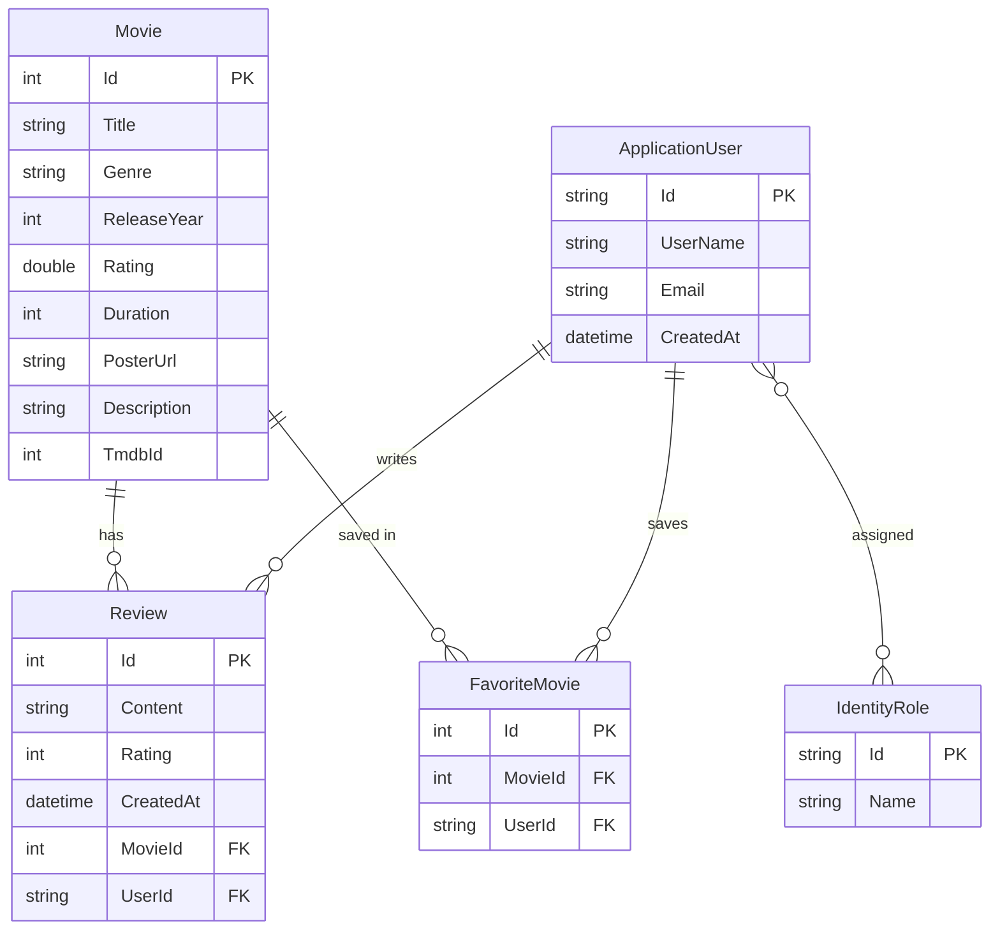

# ER Diagram – JMDB

## Tables

| Table | Description |
|---|---|
| Movies | The movie library — both manually created and imported from TMDB |
| AspNetUsers | Registered users (extends ASP.NET Identity) |
| Reviews | User reviews with a 1–10 rating, linked to movie and user |
| FavoriteMovies | Junction table — which users have favorited which movies |
| AspNetRoles | Roles: Admin, Member |
| AspNetUserRoles | Junction table — which roles each user has |
