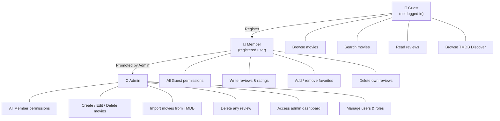

# User Roles – JMDB

JMDB uses three roles managed by ASP.NET Identity.

## Permission Matrix

| Feature | Guest | Member | Admin |
|---|:---:|:---:|:---:|
| Browse & search movies | ✅ | ✅ | ✅ |
| Read reviews | ✅ | ✅ | ✅ |
| Browse TMDB Discover | ✅ | ✅ | ✅ |
| Register / Login | ✅ | — | — |
| Write reviews & ratings | ❌ | ✅ | ✅ |
| Add to favorites | ❌ | ✅ | ✅ |
| Delete own reviews | ❌ | ✅ | ✅ |
| Create / Edit / Delete movies | ❌ | ❌ | ✅ |
| Import from TMDB | ❌ | ❌ | ✅ |
| Delete any review | ❌ | ❌ | ✅ |
| Admin dashboard | ❌ | ❌ | ✅ |
| Manage users & roles | ❌ | ❌ | ✅ |
